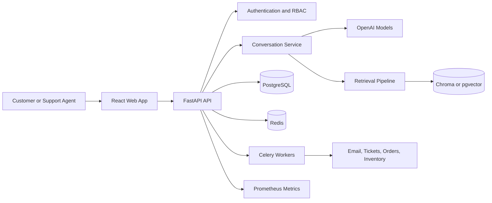

# AI Support Platform

> An enterprise-ready AI customer support platform that combines real-time conversations, retrieval-augmented generation, and safe business automation.

[](backend/)
[](frontend/)
[](docker/)
[](LICENSE)

## Why this project matters

Most support assistants stop at answering questions. **AI Support Platform** is designed to become an operational layer for customer service: it understands company documentation, keeps conversation context, and can execute controlled actions such as creating tickets, checking orders, sending emails, and generating quotations.

The project demonstrates how to combine modern AI application patterns with the engineering foundations expected from a production-oriented SaaS system: asynchronous APIs, typed contracts, role-based access control, background jobs, observability, containerized development, and a clear separation between user-facing experiences and domain services.

## Product capabilities

| Capability | What it demonstrates |
| --- | --- |
| **Streaming AI chat** | Real-time token streaming, conversation memory, Markdown rendering, and code-aware responses. |
| **Document intelligence** | Upload and process PDF, DOCX, TXT, Markdown, and HTML files into searchable knowledge bases. |
| **RAG pipeline** | Chunking, embeddings, vector similarity search, and grounded answers from internal documentation. |
| **AI tool calling** | Structured function execution for customers, orders, tickets, email, FAQs, inventory, and quotations. |
| **Enterprise security** | JWT authentication, refresh tokens, secure password hashing, RBAC, rate limiting, and audit trails. |
| **Operations dashboard** | Support metrics, AI usage analytics, conversation history, and tool execution observability. |

## Architecture



The platform is organized as a modular monorepo. The backend owns the API, domain logic, authentication, persistence, retrieval, and asynchronous jobs. The frontend provides the support workspace, customer chat experience, and administrative views. Docker Compose supplies a reproducible local environment with PostgreSQL, pgvector, Redis, Chroma, the API, a worker, and the frontend.

## Technology stack

| Layer | Technologies |
| --- | --- |
| **API and domain** | Python 3.13, FastAPI, Pydantic v2, SQLAlchemy 2 async, Alembic |
| **AI and retrieval** | OpenAI API, LangChain, embeddings, ChromaDB / pgvector |
| **Data and jobs** | PostgreSQL 16, Redis 7, Celery |
| **Web application** | React 18, TypeScript, Vite 5, Tailwind CSS, TanStack Query, Zustand |
| **Platform** | Docker, Docker Compose, Nginx, GitHub Actions, Prometheus |
| **Quality** | Ruff, Black, MyPy, ESLint, Prettier, pytest, pre-commit |

## Getting started

### Prerequisites

Install Docker and Docker Compose, Node.js 20 or newer, Python 3.13 or newer, and an OpenAI API key. Docker is the recommended path because it starts the complete local service topology consistently.

### Run with Docker

```bash
git clone https://github.com/<your-account>/ai-support-platform.git
cd ai-support-platform
cp .env.example .env
# Edit .env and set OPENAI_API_KEY and a strong SECRET_KEY.
make docker-up
```

Once the services are healthy, open the following endpoints:

| Service | URL |
| --- | --- |
| Frontend | http://localhost:3000 |
| Backend API | http://localhost:8000 |
| Swagger UI | http://localhost:8000/docs |
| ReDoc | http://localhost:8000/redoc |

### Run services individually

For backend development, create a virtual environment, install the development dependencies, apply migrations, and start the API. In a second terminal, install the frontend dependencies and start Vite.

```bash
cd backend
python -m venv .venv
source .venv/bin/activate
pip install -e ".[dev]"
alembic upgrade head

cd ../frontend
npm ci
npm run dev
```

The complete command catalogue is available in the root [`Makefile`](Makefile), while service-specific setup lives in [`backend/`](backend/) and [`frontend/`](frontend/).

## API surface

The API is versioned under `/api/v1`. Core flows include registration and login, token refresh, streaming chat, conversation management, document upload and processing, knowledge-base management, dashboard analytics, and AI usage reporting. The interactive OpenAPI documentation is available at `/docs` whenever the backend is running.

The tool-calling layer includes `search_customers`, `search_orders`, `search_products`, `create_support_ticket`, `send_email`, `schedule_appointment`, `search_faqs`, `check_inventory`, and `generate_quotation`. These tools are represented as application services so business actions remain testable and auditable instead of being hidden inside prompts.

## Quality and testing

Run the project checks through the provided Make targets:

```bash
make test
make lint
make format
```

Backend-only and frontend-only commands are also available. The repository includes automated checks under `.github/workflows/` and local pre-commit configuration in [`.pre-commit-config.yaml`](.pre-commit-config.yaml).

## Security principles

Never commit `.env` files, API keys, private certificates, database passwords, or production credentials. Start from [`.env.example`](.env.example), generate unique secrets for each environment, and use a secret manager for deployments. The repository ignores common virtual environments, dependency caches, build output, uploads, logs, databases, and key material by default.

This project is a portfolio and engineering demonstration. Before production use, review provider data-handling requirements, harden deployment defaults, configure managed secrets, add integration tests for every external action, and perform a dedicated security assessment.

## Repository layout

```text
.
├── backend/              # FastAPI application, domain services, migrations, and tests
├── frontend/             # React and TypeScript web application
├── docker/               # Dockerfiles, Compose topology, and Nginx configuration
├── docs/                 # Architecture and operational documentation
├── scripts/              # Development and maintenance utilities
├── tests/                # Cross-service and integration-oriented tests
├── .github/workflows/    # Continuous integration workflows
├── Makefile              # Common developer commands
└── .env.example          # Safe configuration template
```

## Roadmap

The next engineering milestones are production-grade integration adapters, richer evaluation datasets for retrieval quality, end-to-end test coverage for tool execution, streaming observability, tenant isolation, and deployment documentation for managed PostgreSQL, Redis, and vector infrastructure.

## Contributing

Contributions are welcome. Please open an issue describing the proposed change before submitting a pull request. Keep changes focused, add or update tests, document configuration changes, and run the formatting and linting checks locally.

## License

This project is distributed under the MIT License. See [`LICENSE`](LICENSE) for the complete text.

---

**Built to showcase practical AI engineering, platform architecture, and product thinking.**

[Open an issue](../../issues) · [Explore the API docs](http://localhost:8000/docs) · [Review the architecture](docs/architecture.md)

## References

[1]: https://fastapi.tiangolo.com/ "FastAPI documentation"
[2]: https://docs.docker.com/compose/ "Docker Compose documentation"
[3]: https://platform.openai.com/docs/overview "OpenAI platform documentation"
[4]: https://www.postgresql.org/docs/ "PostgreSQL documentation"
[5]: https://docs.github.com/en/actions "GitHub Actions documentation"

The links above provide the official documentation for the primary technologies used by this project. They are included for readers evaluating the engineering decisions and development workflow.
