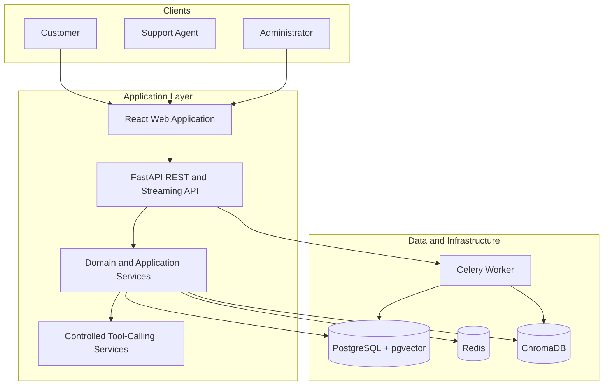

# Architecture Overview

## System context

AI Support Platform is a modular customer-support system. Users interact through a React application, while the FastAPI backend coordinates identity, conversations, retrieval, persistence, and business actions. Long-running work is delegated to Celery workers so document processing and integrations do not block chat requests.

## Request lifecycle

A standard chat request is authenticated, associated with a conversation, enriched with relevant knowledge-base context, and sent to the model with the enabled tool definitions. The model response is streamed back to the client. If a tool is selected, the application validates its arguments, checks authorization, executes the domain service, records the result, and continues the response cycle.

Document ingestion follows a separate path. An uploaded file is persisted with processing metadata, parsed into text, split into chunks, embedded, and written to the configured vector store. The chat service then retrieves the most relevant chunks for each user query.

## Engineering boundaries

| Boundary | Responsibility |
| --- | --- |
| **API layer** | HTTP contracts, authentication dependencies, request validation, and response streaming. |
| **Application services** | Use-case orchestration, transaction boundaries, and coordination between domain and infrastructure components. |
| **Domain layer** | Business concepts, rules, roles, and stable interfaces independent of external providers. |
| **Infrastructure layer** | Database repositories, AI clients, vector stores, email providers, and external integrations. |
| **Worker layer** | Asynchronous document processing, notifications, and background jobs. |
| **Frontend** | User experience, client-side state, API integration, and role-aware navigation. |

## Security model

The application uses JWT-based authentication with access and refresh tokens. Authorization is role-aware, and business tools should be invoked only after validating the current user's permissions and the tool's input schema. Sensitive configuration is injected through environment variables and must not be committed to version control.

For a production deployment, each tenant should have isolated data access policies, managed secrets, TLS termination, centralized logging, backups, and explicit retention controls for conversation and document data.

## Operational considerations

The service topology is designed for local reproducibility first. PostgreSQL stores transactional data, Redis supports cache and job coordination, ChromaDB or pgvector supports semantic retrieval, and Prometheus-compatible metrics provide a foundation for operational dashboards. Scaling can be introduced independently: API replicas for concurrent conversations, workers for ingestion volume, and managed data services for durability.
